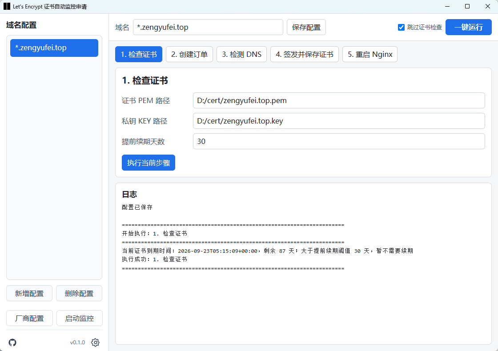
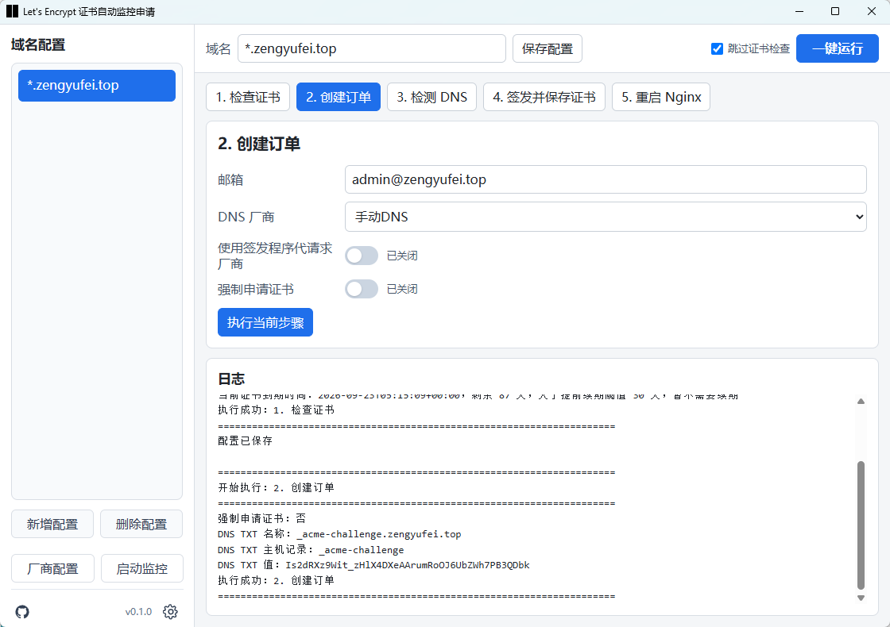
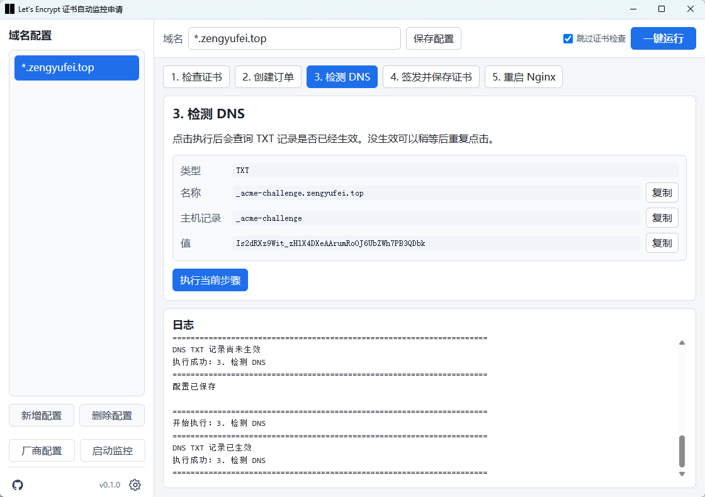
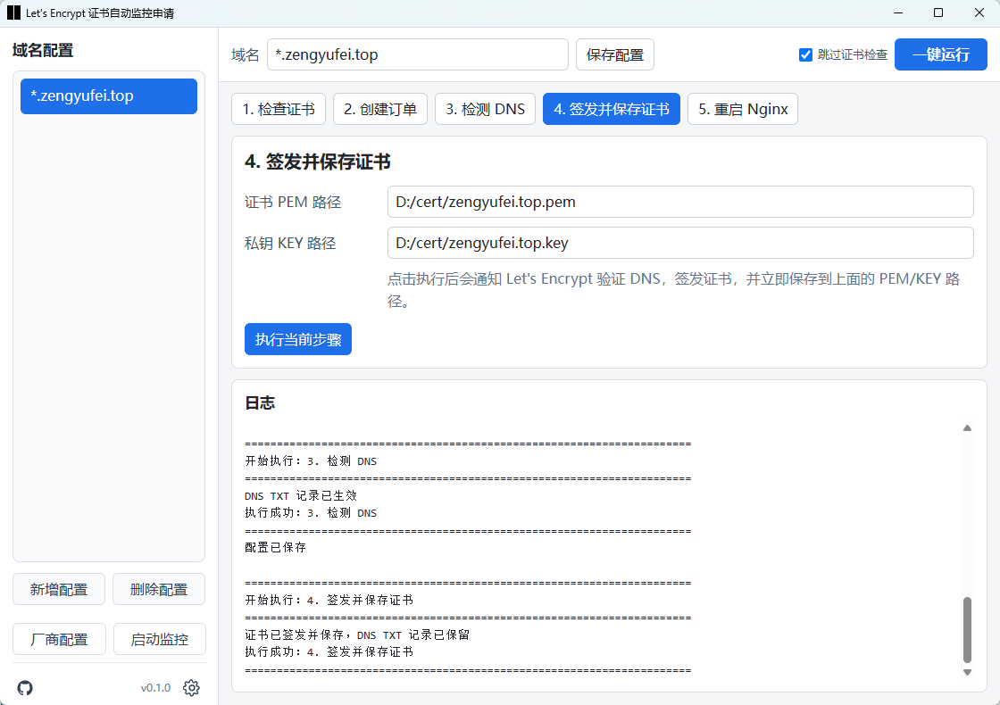
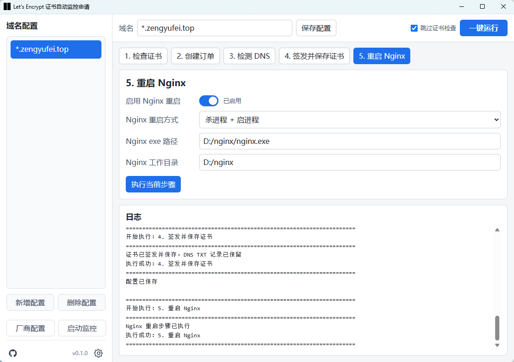
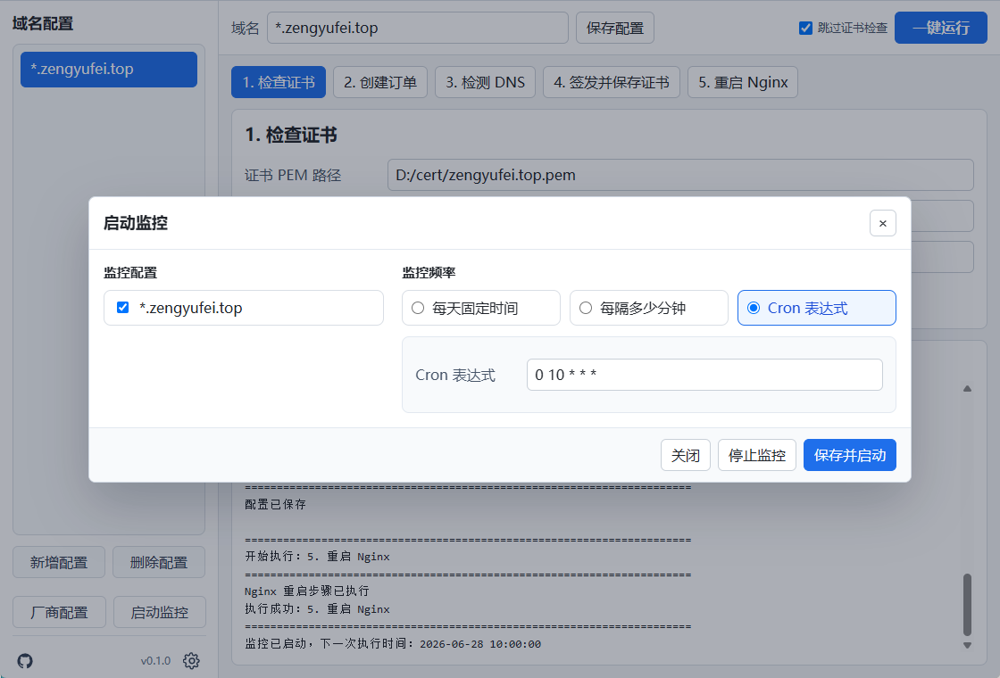
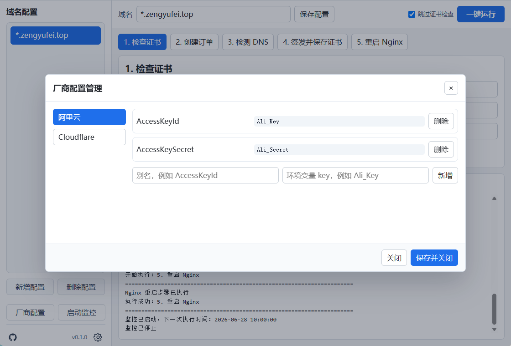

# SSL Certificate Auto Renewal

A Windows Let's Encrypt DNS-01 certificate renewal tool with a Tauri GUI, CLI, and restricted DNS signer agent.

[中文 README](README.zh.md) · [Repository](https://github.com/zengyufei/ssl-renew) · [License](LICENSE) · [Changelog](CHANGELOG.md)

## Introduction

SSL Certificate Auto Renewal manages multiple domain certificate profiles and connects certificate checks, ACME order creation, DNS TXT validation, certificate issuing, certificate saving, Nginx restart, and scheduled monitoring. The GUI is intended for day-to-day setup and manual runs, the CLI is useful for scripts, and `ssl-signer-agent` can keep DNS API keys inside a restricted helper process instead of exposing them to the main app for longer than necessary.

This project is suitable for Windows servers or operator workstations that manage Let's Encrypt certificates, especially wildcard certificates that require DNS-01 validation. It is not a commercial signing product, an enterprise SLA platform, a cross-platform installer, or a fully managed DNS/reverse-proxy control plane. Manual DNS mode is also not suitable for unattended renewal.

## Screenshots

The screenshots follow the main workflow. `1-5` map to certificate processing steps, `6` shows monitoring, and `7` shows environment variable configuration.









## Features

- Multi-domain profile management stored in `profiles.yaml`.
- Manual DNS, Aliyun, Cloudflare, and signer-agent DNS modes.
- Certificate check, order creation, DNS check, issue/save, Nginx restart, and one-click run.
- Scheduled monitoring by daily time, interval minutes, or Cron expression.
- Chinese/English UI, light/dark theme, Toast notifications, log rotation, and profile import/export.
- UPX compression and GitHub Release zip packaging.

## Requirements

- Windows x64.
- Building from source requires Rust stable, Node.js, npm, and Tauri 2 dependencies.
- Compressed release builds use `upx-5.1.0-win64/upx.exe` from this repository.
- Nginx restart requires a local Nginx installation and configured `nginx.exe` path plus working directory.

## Install and Run

Download `SSL证书自动续期-vX.Y.Z-windows-x64.zip` from GitHub Releases, extract it, and run `SSL证书自动续期.exe`. The exe is unsigned, so Windows or antivirus software may warn; only allow it if you trust the download source.

Run the GUI from source:

```powershell
cd ssl-renew-gui
npm install
npm run tauri
```

Run the CLI:

```powershell
cargo run -p ssl-renew-cli -- profile list
cargo run -p ssl-renew-cli -- check --domain "*.example.com"
```

Run the signer agent:

```powershell
cargo run -p ssl-signer-agent -- serve
```

## Build

Build the frontend:

```powershell
cd ssl-renew-gui
npm run build
```

Build the Rust CLI and signer:

```powershell
cargo build --release -p ssl-renew-cli
cargo build --release -p ssl-signer-agent
```

Build the GUI exe:

```powershell
cd ssl-renew-gui
npm run tauri:exe
```

Create a compressed release zip:

```powershell
powershell -ExecutionPolicy Bypass -File .\build-release-upx.ps1
```

The zip is written to `target/release/SSL证书自动续期-vX.Y.Z-windows-x64.zip`.

## Minimal Example

Create a domain profile:

```powershell
target\release\ssl-renew-cli.exe profile add "*.example.com"
target\release\ssl-renew-cli.exe profile set --domain "*.example.com" --email admin@example.com --dns-provider manual --cert-file D:/cert/wildcard.example.com.pem --key-file D:/cert/wildcard.example.com.key
```

Manual DNS issue flow:

```powershell
target\release\ssl-renew-cli.exe check --domain "*.example.com"
target\release\ssl-renew-cli.exe order --domain "*.example.com" --force
target\release\ssl-renew-cli.exe dns-check --domain "*.example.com"
target\release\ssl-renew-cli.exe issue --domain "*.example.com"
target\release\ssl-renew-cli.exe restart --domain "*.example.com"
```

Unattended renewal requires Aliyun, Cloudflare, or signer-agent DNS mode and monitor settings.

## Configuration

The default configuration file is `profiles.yaml` in the current directory or one of its parent directories. If it does not exist, the app creates an example profile for `*.example.com`.

Default paths:

- Log file: `./logs/ssl-renew.log`
- ACME account state: `./state/<domain>/`
- ACME order work data: `./work/<domain>/`
- Certificate file: `D:/cert/<domain>.pem`
- Private key file: `D:/cert/<domain>.key`
- Backup directory: `D:/cert/backup`
- Nginx executable: `D:/nginx/nginx.exe`
- Nginx working directory: `D:/nginx`

Environment Variable Configuration manages groups of environment variable names only. It never stores AccessKeys, tokens, or variable values, and it does not select a DNS API type. The default groups are Aliyun (`AccessKeyId -> Ali_Key`, `AccessKeySecret -> Ali_Secret`) and Cloudflare (`API Token -> CF_Token`).

For multiple Aliyun accounts, set distinct Windows environment variable names such as `ALIYUN_A_ID`, `ALIYUN_A_SECRET`, `ALIYUN_B_ID`, and `ALIYUN_B_SECRET`. Then add groups such as “Aliyun A” and “Aliyun B” in the GUI, with `AccessKeyId` and `AccessKeySecret` aliases mapped to the corresponding variable names. Keep Aliyun selected as the DNS provider in Create Order and select the matching environment group. Before execution, the app shows only each variable name and whether it is set, then reads the selected values. It never displays or writes the values.

Groups can contain any additional variables, all of which are checked before execution. Aliyun automatic DNS still requires `AccessKeyId` and `AccessKeySecret`; Cloudflare automatic DNS still requires `API Token`. Manual DNS and signer can also select a group for preflight checks, but do not consume its values. With no group selected, existing profiles continue using their legacy `dns.aliyun.*_env` or `dns.cloudflare.api_token_env` settings.

The CLI can manage these name groups too:

```powershell
target\release\ssl-renew-cli.exe env-group add "Aliyun A" --id aliyun-a
target\release\ssl-renew-cli.exe env-group add-entry aliyun-a AccessKeyId ALIYUN_A_ID
target\release\ssl-renew-cli.exe env-group add-entry aliyun-a AccessKeySecret ALIYUN_A_SECRET
target\release\ssl-renew-cli.exe profile set --domain "*.example.com" --dns-provider aliyun --env-group aliyun-a
```

## Security and Privacy

This project accesses the file system to read and write `profiles.yaml`, certificates, private keys, logs, ACME state, ACME work data, and signer secrets. When Nginx restart is enabled, it runs local Nginx commands or stops and starts the configured Nginx process. The GUI performs these operations through custom Tauri commands; the Tauri capability file only enables default core/event/listen permissions.

Do not commit real `profiles.yaml`, `state/`, `work/`, `logs/`, certificates, private keys, `.env` files, DNS API keys, or signer secrets. `.gitignore` excludes these by default. Environment Variable Configuration saves only variable names, never values. API keys and notification tokens are sensitive and should stay on trusted local machines. Signer high-security mode encrypts DNS keys with a passphrase-derived key and protects metadata with Windows DPAPI.

## CI/CD and Releases

The GitHub Actions release workflow is triggered by `v*` tags. It installs Rust and Node dependencies on a Windows runner, runs core tests and frontend build, builds the three executables, compresses them with UPX, creates a zip, and uploads it to GitHub Releases.

The first CI gate intentionally does not run `cargo test --workspace` because the Tauri build script currently fails in workspace test mode on this project. CI uses `cargo test -p ssl-core -p ssl-renew-cli -p ssl-signer-agent` instead.

## Maintenance

This is a personal project maintained when time allows. Response time is not guaranteed. Issues and pull requests are welcome, but please do not paste real domain account data, API keys, certificate private keys, or full runtime state files into public issues.

## License

This project uses the [MIT License](LICENSE), allowing use, modification, and distribution.
